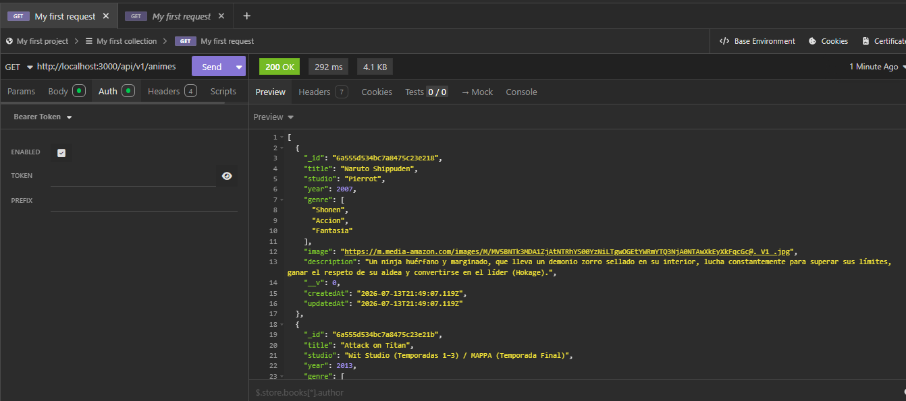
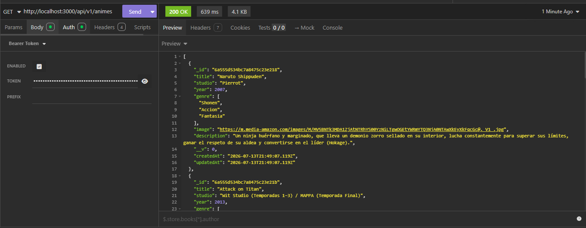
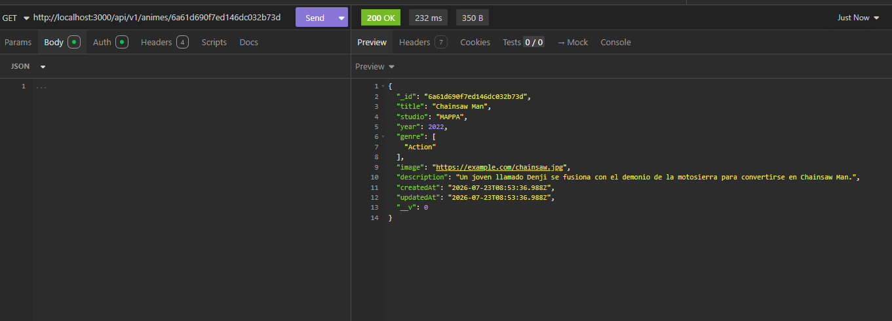
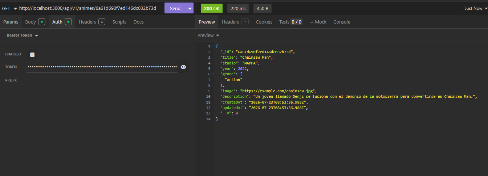
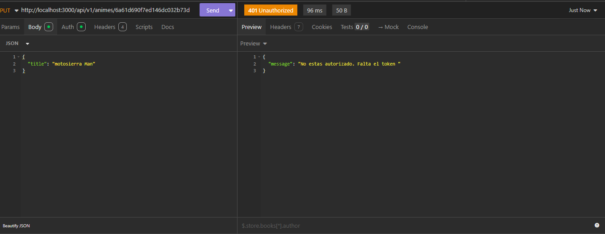
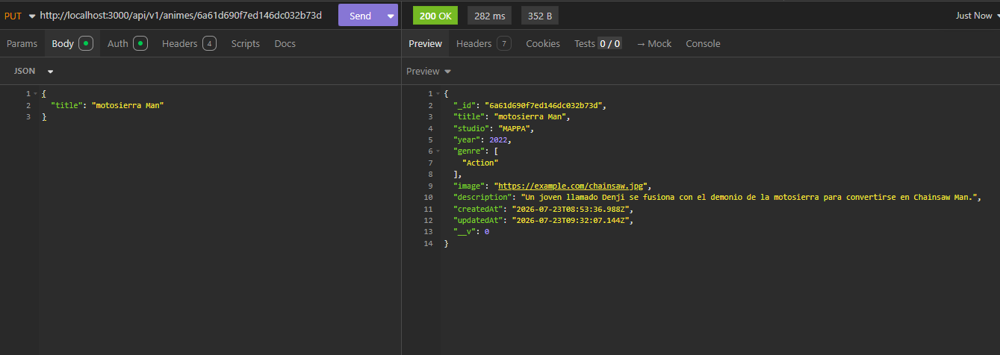
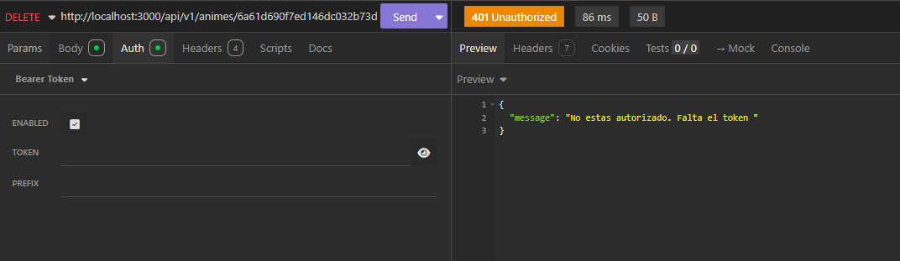
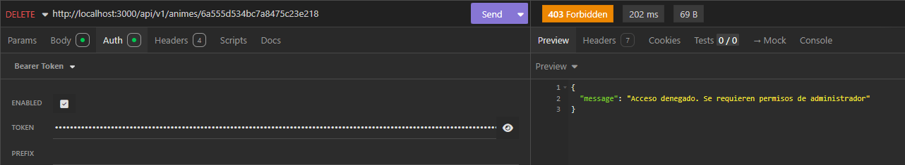
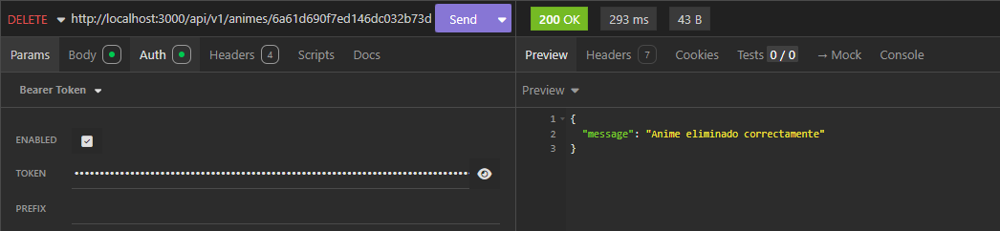
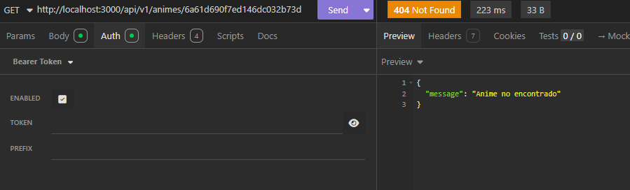

# 🎬 Backend PROMETEO - API REST de Animes

API RESTful desarrollada con Node.js, Express y MongoDB para la gestión de un catálogo de animes y favoritos de usuarios. Incluye autenticación mediante JWT (JSON Web Tokens) y control de acceso basado en roles (`user` y `admin`).

---

## 🛠️ Tecnologías

* **Entorno / Framework:** Node.js + Express.js
* **Base de datos:** MongoDB + Mongoose
* **Seguridad / Auth:** JWT (JSON Web Tokens) + Bcrypt
* **Gestor de paquetes:** PNPM
* **Pruebas de API:** Insomnia

---

## 🚀 Instalación y Despliegue Local

1. **Clonar el repositorio e instalar dependencias:**
   ```bash
   git clone https://github.com/cristianpglz/BackendProyect-PROMETEO.git
   cd BackendProyect-PROMETEO
   pnpm install
   ```

2. **Configurar variables de entorno:**
   Crea un archivo `.env` en la raíz (basándote en `.env.example`):
   ```env
   PORT=3000
   MONGO_URI=tu_cadena_de_conexion_mongodb
   JWT_SECRET=tu_clave_secreta_jwt
   ```

3. **Cargar datos iniciales (Seeder) e iniciar el servidor:**
   ```bash
   pnpm seed
   pnpm dev
   ```
   *(El servidor se ejecutará en `http://localhost:3000`)*

---

## 📌 Endpoints de la API

| Método | Ruta | Acceso | Descripción |
| :--- | :--- | :--- | :--- |
| `POST` | `/api/v1/users/register` | Público | Registro de usuario (`role: "user"` por defecto) |
| `POST` | `/api/v1/users/login` | Público | Login de usuario y obtención del Token JWT |
| `GET` | `/api/v1/users/profile` | Auth (`isAuth`) | Perfil de usuario con animes favoritos populados |
| `POST` | `/api/v1/users/favorites/:animeId` | Auth (`isAuth`) | Añadir un anime a la lista de favoritos |
| `DELETE` | `/api/v1/users/favorites/:animeId` | Auth (`isAuth`) | Eliminar un anime de la lista de favoritos |
| `GET` | `/api/v1/animes` | Público | Obtener el catálogo completo de animes |
| `GET` | `/api/v1/animes/:id` | Público | Consultar un anime por su ID |
| `POST` | `/api/v1/animes` | Admin (`isAdmin`) | Crear un nuevo anime |
| `PUT` | `/api/v1/animes/:id` | Admin (`isAdmin`) | Editar un anime existente |
| `DELETE` | `/api/v1/animes/:id` | Admin (`isAdmin`) | Eliminar un anime del catálogo |

---

## 📸 Evidencias y Pruebas de Funcionamiento (Insomnia)

### 1. Consultas al Catálogo (`GET`)

* **`GET /api/v1/animes` (Sin Admin / Público):**
  

* **`GET /api/v1/animes` (Con Admin):**
  

* **`GET /api/v1/animes/:id` (Sin Admin / Público):**
  

* **`GET /api/v1/animes/:id` (Con Admin):**
  

---

### 2. Edición de Registros (`PUT`)

* **`PUT /api/v1/animes/:id` sin Token (`401 Unauthorized`):**
  

* **`PUT /api/v1/animes/:id` con Admin (`200 OK`):**
  

---

### 3. Borrado y Control de Permisos (`DELETE`)

* **`DELETE /api/v1/animes/:id` sin Token (`401 Unauthorized`):**
  

* **`DELETE /api/v1/animes/:id` con Usuario Estándar (`403 Forbidden`):**
  

* **`DELETE /api/v1/animes/:id` con Admin (`200 OK`):**
  

---

### 4. Verificación de Borrado

* **Consulta tras eliminación (`404 Not Found`):**
  